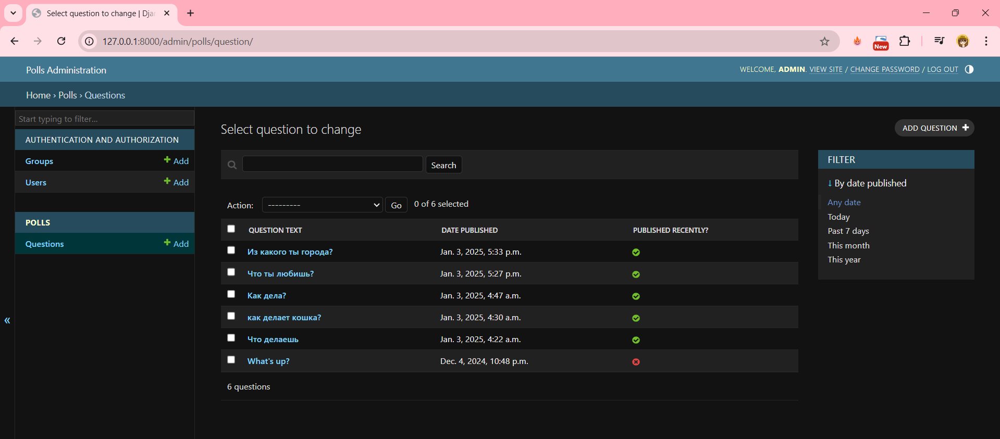

# Лабораторная работа №4.
Применение форм в Django. Аутентификация и регистрация пользователей.

### 1. Создадим форму для добавления опросов зарегистрированным пользователям:

```polls/forms.py```

```python
from django import forms
from .models import Question

class PollForm(forms.ModelForm):
    choices = forms.CharField(widget=forms.Textarea, help_text="Каждый вариант на отдельной строке.")
    
    class Meta:
        model = Question
        fields = ['question_text', 'choices']
```

Тогда нам нужно создать представление, которое будет обрабатывать форму для создания опроса и добавления вариантов

```polls/views.py``` примет вид:

```python
from django.db.models import F
from django.contrib.auth.decorators import login_required
from django.http import HttpResponseRedirect
from django.shortcuts import get_object_or_404, render, redirect
from django.utils import timezone
from django.urls import reverse
from django.views import generic

from .models import Choice, Question
from .forms import PollForm 

class IndexView(generic.ListView):
    template_name = "polls/index.html"
    context_object_name = "latest_question_list"
    
    def get_queryset(self):
        # Возвращает последние пять опубликованных вопроса
        return Question.objects.filter(pub_date__lte=timezone.now()).order_by("-pub_date")[:5]

class DetailView(generic.DetailView):
    model = Question
    template_name = "polls/detail.html"

class ResultsView(generic.DetailView):
    model = Question
    template_name = "polls/results.html"

def vote(request, question_id):
    question = get_object_or_404(Question, pk=question_id)
    try:
        selected_choice = question.choice_set.get(pk=request.POST["choice"])
    except (KeyError, Choice.DoesNotExist):
        return render(
            request,
            "polls/detail.html",
            {
                "question": question,
                "error_message": "You didn't select a choice.",
            },
        )
    else:
        selected_choice.votes = F("votes") + 1
        selected_choice.save()
        return HttpResponseRedirect(reverse("polls:results", args=(question.id,)))

@login_required
def create_poll(request):
    if request.method == 'POST':
        form = PollForm(request.POST)
        if form.is_valid():
            question = form.save(commit=False)
            question.pub_date = timezone.now()
            question.save()
            
            choices = request.POST.get('choices').splitlines()
            for choice_text in choices:
                if choice_text.strip():
                    Choice.objects.create(question=question, choice_text=choice_text.strip())
            return redirect('polls:index') 
    else:
        form = PollForm()
    return render(request, 'polls/create_poll.html', {'form': form})

```

Далее добавим маршруты для новой страницы с формой создания опроса в файл ```polls/urls.py```:

```python
from django.urls import path
from . import views

app_name = "polls"

urlpatterns = [
    # Главная страница с опросами
    path("", views.IndexView.as_view(), name="index"),
    # Страница с деталями опроса
    path("<int:pk>/", views.DetailView.as_view(), name="detail"),
    # Страница с результатами опроса
    path("<int:pk>/results/", views.ResultsView.as_view(), name="results"),
    # Страница для голосования
    path("<int:question_id>/vote/", views.vote, name="vote"),
    # Страница для создания нового опроса
    path("create/", views.create_poll, name="create_poll"),

]

```

### 2. Теперь перейдем к созданию шаблонов. Для начала создадим базовый шаблон, от которого все будет наследоваться, в моем случае это base_generic.html. 

```polls/base_generic.html``` будет иметь вид:

```html
<!DOCTYPE html>
<html lang="en">
<head>
    
    <meta charset="UTF-8">
    <meta name="viewport" content="width=device-width, initial-scale=1.0">
    <title>Polls</title>
    <link rel="stylesheet" href="https://stackpath.bootstrapcdn.com/bootstrap/4.5.2/css/bootstrap.min.css">
    <style>
        body {
            background-image: url("");
            background-size: cover;
            background-repeat: no-repeat;
            background-attachment: fixed;
            color: #000000; 
        }
    </style>
    
</head>
<body>
    <div class="container mt-4">
        <h1><a href="" style="color: rgb(0, 0, 0);">Опросы</a></h1>
        
            <p>Добро пожаловать, {{ user.username }}! <a href="" style="color: rgb(241, 77, 77);">Выйти</a></p>
            <p><a href="" style="color: rgb(24, 51, 131);">Создать новый опрос</a></p>
        
            <p><a href="" style="color: rgb(54, 73, 80);">Войти</a> или <a href="" style="color: rgb(54, 73, 80);">Зарегистрироваться</a></p>
        
    </div>

    <div class="container">
        
        
    </div>


    <script src="https://code.jquery.com/jquery-3.5.1.slim.min.js"></script>
    <script src="https://cdn.jsdelivr.net/npm/@popperjs/core@2.5.1/dist/umd/popper.min.js"></script>
    <script src="https://stackpath.bootstrapcdn.com/bootstrap/4.5.2/js/bootstrap.min.js"></script>
</body>
</html>

```
Шаблон для создания опроса пользователями ```polls/create_poll.html```

```html





  <h2>Создать новый опрос</h2>
  <form method="post">
    
    {{ form.as_p }}

    <button type="submit" class="btn btn-primary">Создать</button>
  </form>


```

### 3. Перейдем к аутентификации. Настроим маршруты для этого, добавив в ```polls/urls.py```, следующий код:

```python
urlpatterns = [

    # Маршруты для аутентификации
    path("login/", views.login_view, name="login"),
    path("logout/", views.logout_view, name="logout"),
    path("register/", views.register, name="register"),
]
```

Теперь создадим представления для регистрации, входа и выхода в файле polls/views.py:

```python

from django.contrib.auth.decorators import login_required
from django.shortcuts import get_object_or_404, render, redirect
from django.contrib.auth.forms import UserCreationForm, AuthenticationForm
from django.contrib.auth import login, logout

# Существующие представления

# Представление для регистрации
def register(request):
    if request.method == 'POST':
        form = UserCreationForm(request.POST)
        if form.is_valid():
            user = form.save()
            login(request, user)
            return redirect('polls:index') 
    else:
        form = UserCreationForm()
    return render(request, 'polls/register.html', {'form': form})

# Представление для входа
def login_view(request):
    if request.method == 'POST':
        form = AuthenticationForm(data=request.POST)
        if form.is_valid():
            user = form.get_user()
            login(request, user)
            return redirect('polls:index')
    else:
        form = AuthenticationForm()
    return render(request, 'polls/login.html', {'form': form})

# Представление для выхода
def logout_view(request):
    logout(request)
    return redirect('polls:index') 

```

Теперь создадим шаблоны для регистрации, входа и выхода в ```polls/templates/polls/```:

* ```register.html```:

```html



  <h2>Регистрация</h2>
  <form method="post">
    
    {{ form.as_p }}
    <button type="submit" class="btn btn-primary">Зарегистрироваться</button>
  </form>

```

* ```login.html```:

```html



  <h2>Вход</h2>
  <form method="post">
    
    {{ form.as_p }}
    <button type="submit" class="btn btn-primary">Войти</button>
  </form>

```

Выход, как правило, обрабатывается через кнопку или ссылку, поэтому отдельный шаблон для выхода не требуется. Просто добавим ссылку на выход в шаблон base_generic.html. Итоговый шаблон был представлен выше.

Перейдем к скриншотам, как выглядит наше готовое веб-приложение. 
Внешний вид сайта неавторизованного пользователя по ссылке http://127.0.0.1:8000/polls/:


Страница входа, если уже имеется аккаунт на сайте. По ссылке http://127.0.0.1:8000/polls/login/:


Страница регистрации по ссылке http://127.0.0.1:8000/polls/register/:


Внешний вид сайта авторизованного пользователя по ссылке http://127.0.0.1:8000/polls/:


Страница создания опроса авторизованным пользователем по ссылке http://127.0.0.1:8000/polls/create/:


Как изменилась панель администратора:




Полный код и содержание веб-приложения представлены в ветке [master](https://github.com/MarinaVasilevaIVT/django_project2/tree/master)
